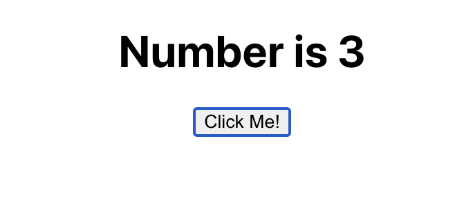
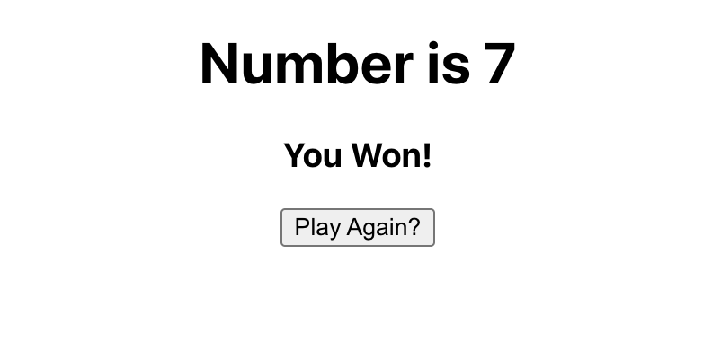

# Clicker Project

## Tasks

 

* Have an < h1 > tag that displays 'Number is X' with X being a random number between 1 and 10 (not 7)

* Below is a button that says 'Random Number'

* Each time the Random Number button is pressed, it should randomly generate a new number

* If the number is 7 it should hide the button and display 'YOU WIN' in its stead

## Successfully Built App

* Created application by using this.state to assign random number variable that is originally set to 1
* When button is clicked, randNum function is called and resets state num variable to a random number 1-10
* Conditionally Displays:
  *  Click Me button to generate random number if number is not 7
  * You Win message displayed if number is 7 
  * Play Again button if number is 7 

## Screenshots

  
  

  
