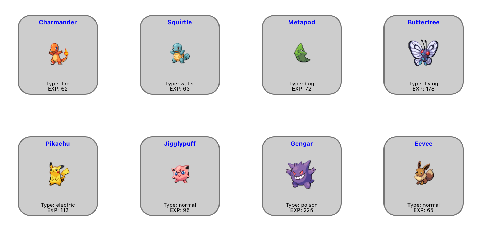
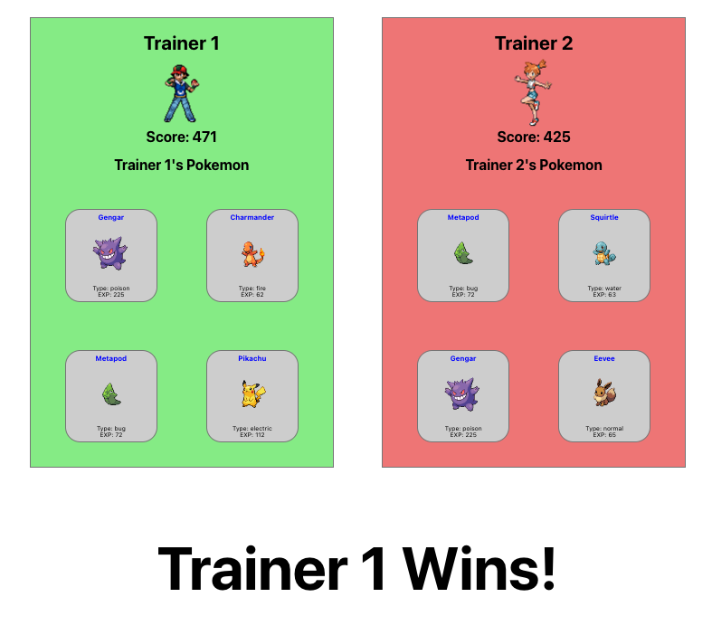
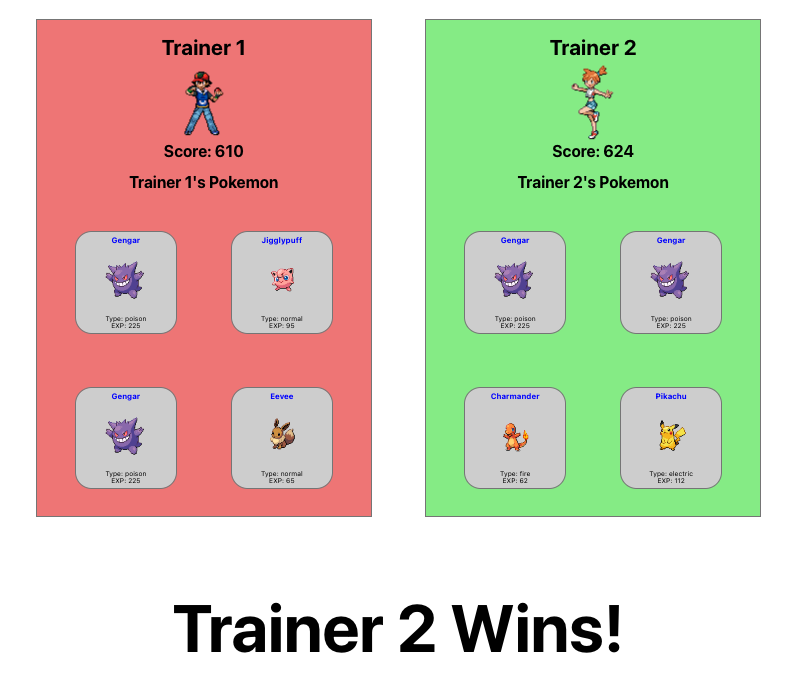

# Pokedex Project

## Pokedisplay

Displays all Pokemon that are available along with their values

## Pokegame

Randomly generates two teams of Pokemon (from all available) and calculates winning trainer based on total experience points. Adds dynamic styling based on results.

